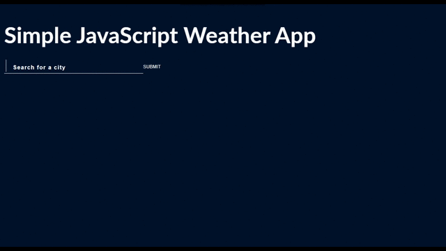

# JS-Weather-App

 

  Using Vanilla JavaScript, and OpenWeatherAPI.  
  There are 2 elements in this app:  
    <ul>
      <li>A heading, a search form and an empty span element </li>
      <li>A list of cities</li>
     </ul>

  Whenever the user presses 'Enter' or clicks on 'Submit', 2 things happen:  
    <ul>
      <li>Stop the form from loading, and hence prevent page-reload</li>
      <li>Grab the value in the search field</li>
    </ul>

Updated: March 6, 2021 

